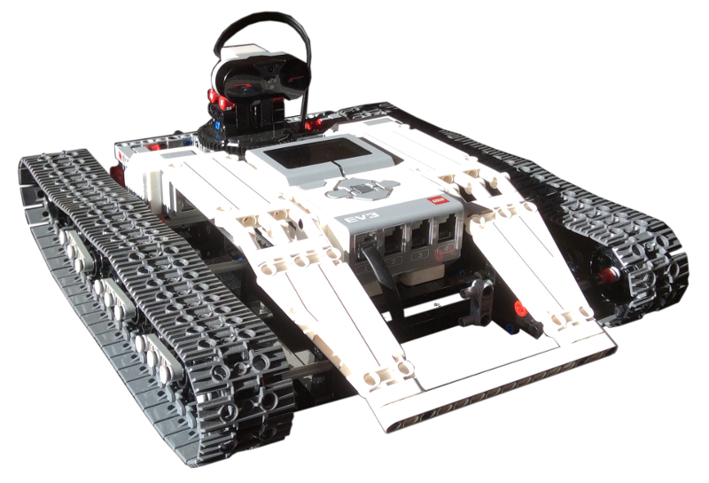

# Ev3RemoteController

UWP Application to remotely control a Lego Mindstorms Ev3 robot running [ev3dev firmware](www.ev3dev.org)  and a local application built with the [Ev3Remoted library](https://github.com/smallrobots/Ev3Remoted) available on this Smallrobots.it GitHub repository.

For details about the Ev3RemoteController app please have a look at the [Smallrobots.it blog](https://www.smallrobots.it/ev3-tracked-explorer-remote-control-app).

Main features:
- Connects to the Ev3 Tracked Explor3r (Lego Mindstorms Ev3) via UDP/IP.
- Accepts driving commands from a gamepad (tested with the PlayStation 4 DualShock controller and [InputMapper](https://inputmapper.com))
- Receceives and displays telemetry data from the Ev3 Tracked Explor3r: battery voltage and draining, readings from the Ev3 Infrared sensor in Proximity mode, large motor speeds and head orientation.

Have fun!

